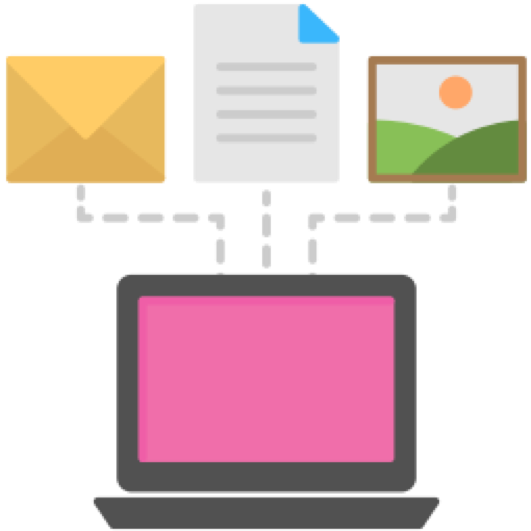

**By answering this question you will understand what is meant by information, and your responsibilities for looking after it.**

What is information and what are my responsibilities?

**We're all responsible**

We’re all responsible for collecting, storing and sharing information. This might include a project plan you are writing, a database of contact details, a handbook or a diary.

Information needs to be looked after, whether you’re at home or work. You would not want anyone to have access to your bank account details, in the same way it wouldn’t be appropriate for most people to see detailed information about your work.

You wouldn’t leave a letter from your bank on the bus or train. You need to treat the information you handle at work with the same care.

**More than names and addresses**

Information is a catch-all that covers other related words:

-   Data

-   Folders

-   Files

-   Research and surveys

-   Letters

-   Email

-   Costs, payments and accounting

-   Spreadsheets and databases

-   Video footage and photos

It is important you think about all the information you’re responsible for at work. If we said ‘data’, you might only think about numbers and spreadsheets. Likewise, if we said ‘email’, you might only think about the security or number of emails that you send and receive.

Information is about any channel or document where the contents relate to individual people, processes or decisions.

Photos, email and post may all contain personal information - not just data on a computer

Personal information is anything that might identify a living person:

1.  The information may identify that person directly, such as a name and address

2.  Two or more pieces of information may be used together to identify someone, such as a social media profile and a postcode

‘Special category data’ is information which is particularly sensitive. This information could create more significant risks to a person’s rights and freedoms, for example by putting them at risk of discrimination. Special category data includes information about someone’s race, religion or politics.

**Information you don’t need to look after**

Information that is publically available (for example on our website) is not something you need to consider (although you should keep it up to date). For example, the address of Hackney Town Hall is public information. Information about the services Hackney Council provides is available on our website. The Council’s main contact details are also available for everyone.

Examples of information that would not be publicly known are personal contact details of staff, and details about what individuals or groups pay to Hackney, or the decisions we make on behalf of them. Any example like this should be considered information that needs to be looked after.

**Your responsibilities**

It is your responsibility to keep information safe. This includes:

-   Being careful to only collect or access information if you really need it to carry out your job

-   Knowing what information you already have access to

-   Knowing what information you should share, and with whom

-   Reporting any security incidents

-   Complying with individual rights by seeking advice or referring to the Information Management team as required

There are some tools and processes available within the council to help you with this. For example, the security that is in place for your work computer.

However, these tools and processes only cover a small part of the information you may be responsible for.

**Tasks**

Basic

**What are the 5 sources of information that you use at work every day?**

These could include channels such as email or the phone, information about residents, a filing cabinet or contacts book.

Intermediate

**Describe a piece of information that you are responsible for at work, that needs to be looked after carefully**

This could be a piece of information containing personal information, or information that is not for the public. You can list more than one example if you wish.

Advanced

**Set aside 10 minutes and make a list of all the information for which you are responsible**

**Tip:** Check through your sent items and other email folders for attachments that may contain information which is not available to the public

**Tip:** Look around the space in which you work. Can you see information on display which is not available to the public?
