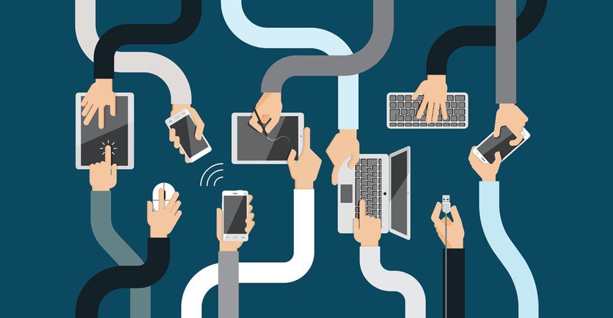

By answering this question you will understand how to keep information safely and securely.

**We are all responsible**

You are responsible for making sure that all information you hold is kept secure.

It is important to understand:

-   what makes a secure password

-   when it is appropriate to use a password

-   why we should use different passwords for locking down different information

-   how to safely share this information with other colleagues

As part of keeping information safe you must think about where it is stored and about the devices you use to access it.

Devices include your work laptop or phone, as well as personal devices: your own phone, tablet or home computer.

**Passwords**

Passwords are key to keeping information you store safe and understanding what makes a strong password is paramount to this. If your password is easy to guess then it will not take a lot of effort or time for someone to break it. Examples of a bad password are:

-   password, password123, etc. This is going to be the first thing someone will try out

-   5678 - spells love on older phone keypads and is one of the most common passcodes after 0000 and 1234

-   Memorable information about yourself, eg, your birthday, pets name, favourite colour. If the attacker has access to any of this information then they will try these out first.

There are a few different approaches to creating a strong password:

1.  Create a string of lower and uppercase letters, along with numbers and special characters

2.  Should be at least 8 characters long

3.  A memorable phrase or set of words that describe something memorable to you, with numbers and uppercase characters. For example ‘Hedge D00r 1ight’

4.  Consider using 2 factor authentication, such as a password and code generated on a separate device

Whichever you approach you take to devising a password, never write passwords down. Writing down passwords, however complicated they might be, is as risky as a bad password.

It is not advised to share passwords between different accounts. If one account is compromised then others would be too.

Password managers such as [LastPass](https://lastpass.com) can be helpful. They allow you to store multiple passwords in one place and incorporate 2 factor authentication.

**Taking care of information in the workplace**

In the office it is important to store information in a logical and routine way. This helps:

-   keep it in order

-   makes it easier to find

-   helps ensure you don’t keep information for longer than is necessary

-   make the information available to the right people at the right time

For example if you have information saved on a laptop, phone as well as hard copies of files in a desk drawer then collating it together may take some time.

This scattered approach to keeping information can also risk a breach of information. Files that have vague labelling or are stored in different ways are more likely to be shared mistakenly as email attachments or in hard copy.

Storing information on your computer desktop or actual desktop is not recommended. File information in the correct folders online, or archive the information appropriately. Seek advice if you’re not sure what to do.

One of the easiest things to do to help take more care of information is simply to print less.

Assuming you’ve taken care of filing, you still need to pay attention to what’s going on around you in the office:

-   Lock your screen when you leave your desk, even if you only plan to be gone for a few minutes

-   When entering your building, don’t tolerate tailgaters - people following you closely through security barriers or locked doors

-   Keep a clear desk and be aware of what is always on your screen for others to see. Sometimes it may be necessary to work on a document in a different location where you are not overlooked.

-   Be cautious about clicking on links sent to you in emails, particularly if the website you are led to asks for login details. Even if you recognise the name of the sender, it may be advisable to call them and check that they have sent that email, before you click the link.

Always lock your screen when leaving your desk

**Taking care of information on the road**

The main difference between keeping information safe on the road, compared to in the office, is that there’s even greater need to make sure your mobile devices are secure and up-to-date.

IT will deliver automatic security updates to your work phone and laptop, but you must ensure these updates are not ignored. Likewise, it is also your responsibility to keep your personal device updated and secure.

You can help keep information on mobile devices safe by only taking them with you, when you need them. The rest of the time, keep phones and laptops locked somewhere close-by, but safe: a locked car boot if your job involves driving, a desk drawer or a secure compartment of a bag.

Stay alert to who can see the information on your screen if you are working in a public place and don’t leave it unattended.

If you lose a work-issued phone or laptop, or a personal device through which you access work information, then you must inform IT immediately.

**Reporting an information breach**

A breach occurs any time information is lost, stolen or shared with the wrong person or people. You may have mailed a customer file to the wrong department, sent private information to the wrong email address or simply realised that a database or contact list cannot be found.

For example: the Council might receive a number of complaints about the same issue, from individual residents. If you were to respond to all the residents in the same email, putting their email addresses in the To field, so they could identify each other, that would be a breach of information. In this example, you should send separate emails to each resident, or put all their addresses in the BCC field.

You must report a breach immediately.

You must make a report to the Information Management team immediately, even if you don’t have all the details, or you are not sure if the incident counts as a breach. You can report a breach from the homepage of the intranet.

Failing to report a breach quickly at London Borough of Hackney can count against you, as misconduct. The Council may also be penalised by the Information Commissioner’s Office.

**Tasks **

Basic

**Create a strong password**

Give an example of a strong password using one of the methods described above methods

Intermediate

**Take more care of information every day**

Share 2 examples in your daily routine where you can take better care of information

Advanced

**Improving your filing**

Write down 3 actions you will take to improve your approach to filing information
